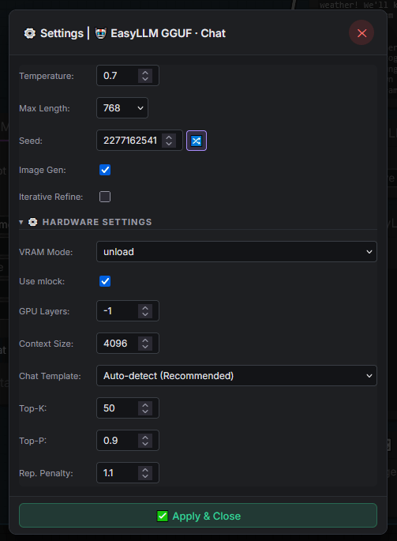
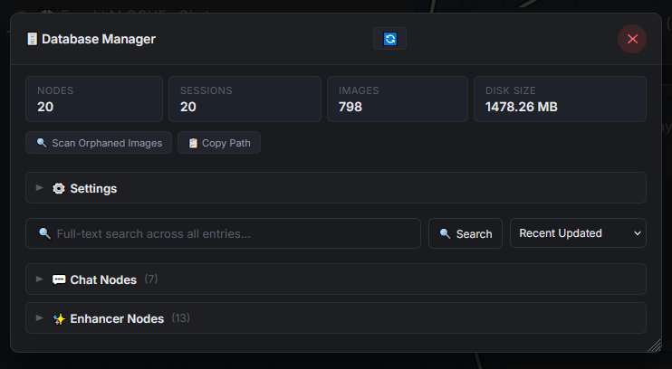
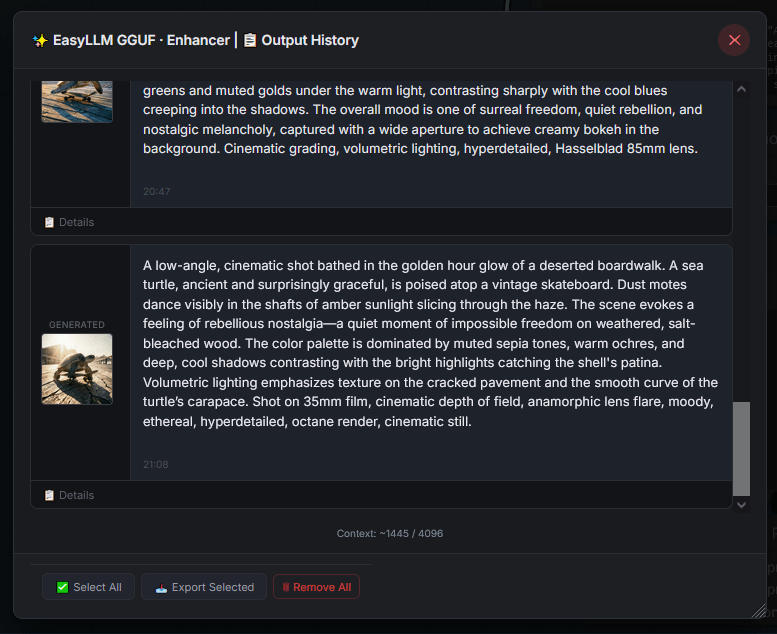

# EasyLLM for ComfyUI

Chat, prompt enhancement, and high-speed GGUF inference — all inside ComfyUI.

**No external services. No Ollama. No LM Studio. No API keys.**

> Already have models for LM Studio? Point EasyLLM at those folders and use the same GGUF files directly inside ComfyUI — no background servers required.
>
> **Note for Ollama users:** Ollama stores models in a proprietary format. Download the original `.gguf` file from Hugging Face instead.

This custom node suite provides a complete local AI workspace embedded inside ComfyUI — from interactive chat and prompt engineering to model browsing and system prompt management.

---

## 🚀 Features

### ⚡ Tier 1 — Why People Install

| Feature | Description |
|---------|-------------|
| **Local GGUF Inference** | Run GGUF models directly inside ComfyUI via `llama-cpp-python` — 30–50+ tok/sec with Q4_K_M |
| **Built-in Model Browser** | Search, filter, and manage local GGUF models with automatic vision detection, family/architecture identification, and mmproj matching |
| **Vision / Multimodal Support** | Use vision-language models (LLaVA, Qwen-VL, Gemma-3-Vision) with automatic mmproj detection — upload images directly from chat, no wires needed |
| **Streaming Chat** | Interactive chat popup with real-time token streaming, conversation history, and markdown rendering |
| **Prompt Enhancement Workflows** | Enhancer mode transforms simple concepts into detailed image prompts — wire directly to CLIP Text Encode → KSampler |

### 📚 Tier 2 — Why People Keep Using It

| Feature | Description |
|---------|-------------|
| **System Prompt Manager** | 11 built-in prompt templates plus custom creation, editing, import, and export — manage your prompt engineering library directly inside ComfyUI |
| **Chat & Enhancer History** | Persistent history with export to Markdown or Plain Text — never lose a good prompt |
| **Model Persistence** | Keep models loaded on GPU between generations for instant chat — no reload delays |
| **Text Utility Nodes** | 7 lightweight text processing nodes — Joiner, Replacer, Extractor, Limiter, Whitespace Cleaner, Duplicate Remover, Text Input |

### 🧠 Tier 3 — Power-User Features

| Feature | Description |
|---------|-------------|
| **CLIP Backend (Optional)** | Use Qwen-based text encoders already loaded by Anima, Z-Image, Flux Klein — zero additional downloads |
| **Auto Chat-Template Detection** | 3-tier pipeline detects the correct chat template from GGUF metadata, architecture, or filename heuristics |
| **Auto-Tuned Sampling** | Model size detection sets optimal temperature, top-K, top-P, and repetition penalty automatically |
| **GPU Acceleration** | TF32 matmul, torch.compile, GPU-vectorized sampling — 1.2–1.5× speedup on Ampere+ GPUs |
| **Memory Management** | Three VRAM modes (unload / keep_loaded / aggressive_free) for any GPU budget |

---

## 📸 Screenshots

### Main Node & Chat Popup


### Model Browser & Prompt Library


### Settings, History & Database







### 🎥 Demo Video

[](media/simple-chat.mp4)

> Click the image above to watch the streaming chat demo.

---

## Table of Contents

- [Quick Start](#quick-start)
- [📚 System Prompt Manager](#-system-prompt-manager)
- [Nodes](#nodes)
  - [⚡ EasyLLM GGUF — High-speed GGUF chat](#-easyllm-gguf--high-speed-gguf-chat)
  - [🤖 EasyLLM — Interactive conversation (CLIP)](#-easyllm--interactive-conversation-clip)
  - [📄 EasyLLM Text — Display output](#-easyllm-text--display-output)
- [Workflow Examples](#workflow-examples)
- [Chat UI Features](#chat-ui-features)
- [📝 Text Utility Nodes](#-text-utility-nodes)
- [Compatible Models](#compatible-models)
- [Auto-Tuned Sampling](#auto-tuned-sampling)
- [Chat Template Auto-Detection (GGUF)](#chat-template-auto-detection-gguf)
- [Vision / Multimodal Support (GGUF)](#vision--multimodal-support-gguf)
- [Installation](#installation)
- [⚡ Speed Optimization Guide](#-speed-optimization-guide)
- [Technical Details](#technical-details)
- [Limitations](#limitations)
- [Troubleshooting](#troubleshooting)

---

## Quick Start

### Minimal GGUF workflow (recommended — fastest)

```
[EasyLLM GGUF] ──> [EasyLLM Text]
     │
     │ model_path: "path/to/qwen2.5-7b-instruct-q4_k_m.gguf"
     │ text: "explain how diffusion models work"
```

Install `llama-cpp-python` once ([see Installation](#installation)), point the GGUF node at any `.gguf` file, and start chatting.

### Minimal CLIP workflow (no extra install)

```
[Load CLIP (Anima)] ──> [EasyLLM] ──> [CLIP Text Encode] ──> [KSampler]
```

No pip install needed. Uses the Qwen model already loaded inside your CLIP text encoder.

---

## 📚 System Prompt Manager

The node includes a built-in **system prompt template manager** with **11 pre-built templates** stored in [`system_prompts.json`](system_prompts.json). This is a complete prompt engineering toolkit — not just a text box.

| Template | Use Case |
|----------|----------|
| **Simple Minimal Enhance** | Add 2-3 visual details to a concept |
| **Natural Language Enhancer** | Transform concepts into natural language descriptions |
| **Danbooru Tag Generator** | Output comma-separated Danbooru-style tags |
| **Mixed Tag + NL** | Combine quality tags with natural language |
| **Tag to Natural Language** | Convert tags into fluent prose |
| **Image Describer** | Brief 1-2 sentence image description |
| **Detail Modifier** | Change one specific visual detail |
| **Art Style Lite** | Identify art medium, technique, and era |
| **Short Budget** | Maximum 50-word description |
| **Prompt Compressor** | Condense prompts to essential information |
| **Negative Prompt Generator** | Generate negative prompts |

### Why it's more than a text box

Most ComfyUI LLM nodes give you a single `system_prompt` text widget. EasyLLM gives you a complete management system:

| Capability | What it means |
|------------|---------------|
| **📝 Edit built-in templates** | Adjust the 11 default prompts to your style |
| **➕ Create custom templates** | Save your own system prompts with names |
| **📥 Import from JSON** | Load prompt libraries shared by the community |
| **📤 Export to JSON** | Share your prompt collections — perfect for Civitai workflows |
| **🔄 Reorder templates** | Drag to arrange by frequency of use |
| **🔍 Search** | Find templates by name instantly |
| **🔗 Share across installations** | Export templates from one ComfyUI, import into another |

### How to access

1. Double-click any node to open the **popup chat**
2. Click **⚙ Manage Prompts...** in the popup footer
3. Or click **⚙ Manage Prompts...** on the node canvas

The management dialog connects to the backend API at `/easyllm/prompts/*` and updates all nodes in real-time when you save changes.


---

## Nodes

### ⚡ `EasyLLM GGUF` — High-speed GGUF chat

Directly loads a `.gguf` model via llama.cpp C++ engine. **30–50+ tok/sec** with Q4_K_M. This is the flagship backend.

#### Section 1: Setup

| Input | Type | Default | Description |
|-------|------|---------|-------------|
| `model_path` | `STRING` | — | Path to `.gguf` file (e.g., `Qwen/Qwen2.5-7B-Instruct-GGUF/qwen2.5-7b-instruct-q4_k_m.gguf`) |
| `mode` | `COMBO` | `chat` | `chat`: Interactive conversation with popup + history. `enhancer`: Direct prompt-to-output. |

#### Section 2: Persona & Input

| Input | Type | Default | Description |
|-------|------|---------|-------------|
| `text` | `STRING` | `""` | Your message to the LLM |
| `prompt_template` | `COMBO` | First template | Select a system prompt template, or `Custom` to write your own |
| `system_prompt_text` | `STRING` | `""` | Custom system prompt (used when template is `Custom`) |

#### Section 3: Generation Parameters

| Input | Type | Default | Description |
|-------|------|---------|-------------|
| `temperature` | `FLOAT` | `0.7` | Sampling temperature. `0.0` = greedy/deterministic. |
| `max_length` | `INT` | `768` | Maximum tokens to generate (16–16384) |
| `seed` | `INT` | `0` | Random seed. `0` = auto-randomize |

#### Section 4: Socket Inputs

| Input | Type | Default | Description |
|-------|------|---------|-------------|
| `text_input` | `STRING` (forceInput) | `""` | Chain input: accepts text from another node. Overrides the text widget when connected. |
| `system_prompt` | `STRING` (forceInput) | `""` | Connect from another node. Overrides template and custom text. |

#### Section 5: Hardware (Advanced)

| Input | Type | Default | Description |
|-------|------|---------|-------------|
| `chat_template` | `COMBO` | `auto` | `auto` = 3-tier auto-detection (recommended). Or select a specific template. |
| `n_ctx` | `INT` | `4096` | Context window size (512–32768) |
| `n_gpu_layers` | `INT` | `-1` | `-1` = all layers on GPU (max speed). `0` = CPU. `24+` = balanced. |
| `use_mlock` | `BOOLEAN` | `True` | Lock model memory to prevent OS swapping |
| `vram_mode` | `COMBO` | `unload` | `unload`: Free VRAM after gen. `keep_loaded`: Model stays on GPU for fast chat. `aggressive_free`: Max VRAM clearance. |
| `top_k` | `INT` | `50` | Top-K sampling. Higher = more diverse. |
| `top_p` | `FLOAT` | `0.9` | Nucleus sampling threshold |
| `repetition_penalty` | `FLOAT` | `1.1` | Repetition penalty. `1.0` = none, `>1.0` discourages repeats |

#### Section 6: Vision / Multimodal (Optional)

| Input | Type | Default | Description |
|-------|------|---------|-------------|
| `image` | `IMAGE` (forceInput) | — | Connect from Load Image node for vision-language models (LLaVA, BakLLaVA, Qwen-VL, etc.) |
| `mmproj_path` | `STRING` | `""` | Path to multimodal projection `.gguf` file. Auto-detected if placed in same folder as model. |
| `image_filename` | `STRING` | `""` | Internal: stores uploaded image filename for no-wire chat mode. Managed automatically by the chat popup. |

| Output | Type | Description |
|--------|------|-------------|
| `text` | `STRING` | The generated response (cleaned — think tags and artifacts removed) |
| `raw_text` | `STRING` | The raw generated text as decoded from the model (preserves think tags, channel tags) |

---

### 🤖 `EasyLLM` — Interactive conversation (CLIP)

Talk to the LLM model loaded inside your CLIP text encoder. **No additional model downloads required.** This backend is optional — use it if you already have a compatible Qwen-based model loaded for image generation, and want to reuse it for text generation.

#### Section 1: Setup

| Input | Type | Default | Description |
|-------|------|---------|-------------|
| `clip` | `CLIP` | — | The CLIP object from Load CLIP / DualCLIPLoader |
| `mode` | `COMBO` | `chat` | `chat`: Interactive conversation with popup + history. `enhancer`: Direct prompt-to-output, wire to CLIP Text Encode. |

#### Section 2: Persona & Input

| Input | Type | Default | Description |
|-------|------|---------|-------------|
| `text` | `STRING` | `""` | Your message to the LLM |
| `prompt_template` | `COMBO` | First template | Select a system prompt template, or `Custom` to write your own |
| `system_prompt_text` | `STRING` | `""` | Custom system prompt (used when template is `Custom`) |
| `system_prompt` | `STRING` (forceInput) | `""` | Connect from another node. Overrides template and custom text. |

#### Section 3: Socket Inputs

| Input | Type | Default | Description |
|-------|------|---------|-------------|
| `text_input` | `STRING` (forceInput) | `""` | Chain input: accepts text from another node. Overrides the text widget when connected. |

#### Section 4: Generation Parameters

| Input | Type | Default | Description |
|-------|------|---------|-------------|
| `temperature` | `COMBO` | `auto` | `auto` = model-optimized; or select `0.0` (greedy), `0.3`, `0.5`, `0.7`, `0.9` to override |
| `max_length` | `INT` | `768` | Maximum tokens to generate (16–4096) |
| `seed` | `INT` | `0` | Random seed. `0` = auto-randomize each generation |

#### Section 5: Hardware (Advanced)

| Input | Type | Default | Description |
|-------|------|---------|-------------|
| `vram_mode` | `COMBO` | `unload` | `unload`: Free VRAM after gen (safe for image workflows). `keep_loaded`: Keep model on GPU for fast sequential chat. `aggressive_free`: Unload ALL non-essential models before & after gen (max VRAM clearance). |
| `use_mlock` | `BOOLEAN` | `False` | Lock model memory to prevent OS swapping |

> **Other sampling parameters (top_k, top_p, repetition_penalty) are automatically tuned** based on the detected model size — see [Auto-Tuned Sampling](#auto-tuned-sampling).

| Output | Type | Description |
|--------|------|-------------|
| `text` | `STRING` | The generated response (cleaned — think tags and artifacts removed) |
| `raw_text` | `STRING` | The raw generated text as decoded from the model (preserves think tags, channel tags) |
| `clip` | `CLIP` | Original CLIP object, passed through |

| New Output (v2) | Type | Description |
|-----------------|------|-------------|
| `image_output` | `IMAGE` | Passthrough of attached image — enables image-to-image workflows via the chat popup |

---

### 🎛️ `LLM_TriggerRouter` — Decompose trigger_prompt JSON

Decomposes the structured `trigger_prompt` JSON from EasyLLM / EasyLLM GGUF into individual sockets. Required for all multi-turn generation workflows.

| Input | Type | Description |
|-------|------|-------------|
| `trigger_prompt` | `STRING` (forceInput) | Connect to LLM node's `trigger_prompt` output. Expects JSON with fields: `action`, `prompt`, `negative_prompt`, `session_uuid` |

| Output | Type | Description |
|--------|------|-------------|
| `prompt` | `STRING` | The image generation prompt (text to feed to CLIP Text Encode) |
| `negative_prompt` | `STRING` | Negative prompt for CLIP Text Encode |
| `session_uuid` | `STRING` | Unique ID for this generation turn — wire to Image Capture for image reconciliation |

---

### 🖼️ `EasyLLM_ImageCapture` — Persist generated images to chat history

Saves generated images to the chat history database, keyed by `session_uuid`. Required for multi-turn generation workflows so generated images appear in the chat popup.

| Input | Type | Description |
|-------|------|-------------|
| `images` | `IMAGE` | Connect VAE Decode output |
| `session_uuid` | `STRING` (forceInput) | Connect Trigger Router's `session_uuid` output |

| Output | Type | Description |
|--------|------|-------------|
| `images` | `IMAGE` | Passthrough of input images for downstream nodes (Preview Image, Save Image) |

---

### 📄 `EasyLLM Text` — Display output

A utility node that displays any text output on the canvas. Useful for viewing generated text from the `EasyLLM` or `EasyLLM GGUF` nodes in a dedicated read-only widget. Features an **"Open Chat"** button to launch the popup for further interaction.

| Input | Type | Description |
|-------|------|-------------|
| `text` | `STRING` (forceInput) | Text to display and pass through |

| Output | Type | Description |
|--------|------|-------------|
| `text` | `STRING` | Passes through the input text for downstream nodes |

---

## Workflow Examples

### Prompt Enhancement (Enhancer Mode)

Set the `EasyLLM` or `EasyLLM GGUF` node's mode to `enhancer` for direct prompt-to-output workflow:

```
[Load CLIP (Anima)] ──> [EasyLLM (mode=enhancer)] ──> [CLIP Text Encode] ──> [KSampler]
                            │                                               │
                            │  "a mystical forest"                         │
                            │  ─────────────────>                          │
                            │  "A mystical forest at twilight, ancient     │
                            │   oaks with glowing runes, fireflies... "    │
```

### Chat (inline response display)

The **EasyLLM** node shows the generated response **directly inside the node** — no separate "Show Text" node needed.

```
[Load CLIP (Anima)] ──> [EasyLLM]
                            │
                            │  "What styles work well with this model?"
                            │
                            │  Response appears inside the node
```

The response text is displayed in a read-only text area with distinct styling. You can still wire the `text` output to a "Show Text" node if needed.

### Chat + EasyLLM Text (alternative)

```
[Load CLIP (Anima)] ──> [EasyLLM] ──> [EasyLLM Text]
                            │
                            │  "What styles work well with this model?"
```

### GGUF Chat

```
[EasyLLM GGUF] ──> [EasyLLM Text]
     │
     │ model_path: "Qwen/Qwen2.5-7B-Instruct-GGUF/qwen2.5-7b-instruct-q4_k_m.gguf"
     │ text: "Explain how diffusion models work"
```

### Text Processing Pipeline

Use the Text Utility nodes to clean, transform, and combine LLM output before it reaches the KSampler:

```
[EasyLLM GGUF] ──> [🧽 Whitespace Cleaner] ──> [🗃️ Duplicate Remover] ──> [CLIP Text Encode]
```

### 🎛️ Multi-Turn Generation with Auto-Queue & Group Router

The **Trigger Router**, **Group Router**, and **Image Capture** nodes enable a powerful multi-turn chat-to-image workflow:

```
EasyLLM ──trigger_prompt──► Trigger Router ──prompt──► CLIP Text Encode (x2)
                                      │               └──negative_prompt──► CLIP Text Encode (neg)
                                      └──session_uuid──► Image Capture ◄── VAE Decode
```

**How it works:**
1. The LLM outputs structured JSON via `trigger_prompt` with an `action` field (`generate_image`, `edit_image`, `just_chat`)
2. The **Trigger Router** decomposes the JSON into individual sockets (prompt, negative_prompt, session_uuid)
3. The frontend **auto-queues** the full pipeline to the target Image Capture node when image generation is requested
4. **Image Capture** saves generated images with `session_uuid` for chat history reconciliation

**Loadable example workflows** are in [`example_workflows/`](example_workflows/):
- [`Enhancer.json`](example_workflows/Enhancer.json) — Single-shot prompt enhancement
- [`InteractiveChat + Generate.json`](example_workflows/InteractiveChat + Generate.json) — Chat + single `[GENERATE]` group
- [`InteractiveChat + Generate + Edit.json`](example_workflows/InteractiveChat + Generate + Edit.json) — Chat + `[GENERATE]` + `[EDIT]` groups

---

## Chat UI Features

The **EasyLLM** and **EasyLLM GGUF** nodes include a built-in chat interface for a more natural interaction experience.

### Popup Chat

Double-click the node to open a popup chat window with:
- **Conversation history** — scrollable chat log with user/assistant messages
- **Multi-turn conversation** — the popup maintains full chat history across exchanges
- **Markdown rendering** — the LLM's responses are rendered with proper formatting (bold, lists, code blocks, etc.)
- **System prompt editor** — customize the system instruction
- **Model selector** — browse and select GGUF models directly from the popup
- **Image upload** — upload images for vision-language models (no wires needed)
- **Send button** — queue the workflow with your message
- **Enter-to-Send** — press Enter to send, Shift+Enter for newline
- **Token streaming** — responses appear token-by-token in real-time


🎥 **[Watch the streaming chat demo](media/simple-chat.mp4)**

### Canvas Widgets

The node displays key controls directly on the canvas:
- **Text input** — type your message
- **Send button** — click to queue generation
- **Response area** — read-only display of the last response
- **Mode selector** — switch between chat and enhancer modes
- **Prompt template** — configure enhancer output format

### Chat Modes

Each node has a mode badge displayed on the canvas:

| Badge | Mode | Description |
|-------|------|-------------|
| 💬 **CHAT** | Chat | Free-form conversation with the LLM |
| 🔧 **ENHANCER** | Enhancer | Transform simple prompts into detailed descriptions |

### Export

Chat and enhancer history can be exported as **Markdown** or **Plain Text** from the popup menu.

---

## 📝 Text Utility Nodes

These lightweight text processing nodes have **no dependencies** on the LLM engine (no llama-cpp, no CLIP). They're found under the **`EasyLLM/text`** category.

| Node | Description | Key Features |
|------|-------------|--------------|
| 📝 **EasyLLM Text Input** | Standalone multi-line text input box. ComfyUI lacks a native text entry node — this fills that gap. | Simple passthrough, dynamic prompts disabled |
| 🔗 **EasyLLM Text Joiner** | Merge two text strings with a configurable delimiter. | Empty-input safe; delimiters: `, `, space, newline, ` - ` |
| 🧹 **EasyLLM Text Replacer** | General-purpose find-and-replace on any string output. | Case-sensitive toggle; empty find = safe passthrough |
| ✂️ **EasyLLM Text Extractor** | Keep text before or after a delimiter word/phrase. | Nth-occurrence selection; case-insensitive mode |
| 📏 **EasyLLM Text Limiter** | Truncate text to max characters, words, or lines. | Choose which side to cut; optional ellipsis |
| 🧽 **EasyLLM Whitespace Cleaner** | Strip leading/trailing whitespace, collapse blank lines. | Trim modes: both, leading, trailing, all_lines |
| 🗃️ **EasyLLM Text Duplicate Remover** | Remove duplicate tags, words, or lines. | First-occurrence wins; case-insensitive by default; configurable separator |

---

## Compatible Models

### GGUF Backend (EasyLLM GGUF) — Recommended

Any GGUF model compatible with llama.cpp. Recommended:
- [Qwen2.5-7B-Instruct-GGUF](https://huggingface.co/Qwen/Qwen2.5-7B-Instruct-GGUF)
- [Qwen2.5-14B-Instruct-GGUF](https://huggingface.co/Qwen/Qwen2.5-14B-Instruct-GGUF)
- [Search HuggingFace for GGUF models](https://huggingface.co/models?search=gguf)

### CLIP Backend (EasyLLM) — Optional

| Model | Text Encoder | Size | Notes |
|-------|-------------|------|-------|
| **Anima** | Qwen3-0.6B | 0.6B | Smallest, fastest. Auto-tuned for stable output. |
| **Z-Image** | Qwen3-4B | 4B | Good balance of speed and quality |
| **Flux Klein** | Qwen3-4B / Qwen3-8B | 4-8B | Best quality, larger models |
| **Qwen-Image** | Qwen2.5-7B-VL | 7B | Vision-language capable |

Models **without** generation support (will show a clear error):
- Standard SD1.5 CLIP (ViT-L/14)
- Standard SDXL CLIP (ViT-bigG)
- Flux T5-only (no Qwen)
- Standard T5 text encoders

---

## Auto-Tuned Sampling

The `EasyLLM` node **automatically detects your model's size** and sets optimal sampling parameters. No more fiddling with `top_k`, `top_p`, or `repetition_penalty`.

| Model | Temperature | top_k | top_p | repetition_penalty |
|-------|:-----------:|:-----:|:-----:|:------------------:|
| **Anima (Qwen3-0.6B)** | 0.3 | 20 | 0.90 | 1.3 |
| **Z-Image / Flux Klein 4B** | 0.6 | 40 | 0.90 | 1.2 |
| **Flux Klein 8B / Unknown** | 0.7 | 50 | 0.95 | 1.1 |

### Why auto-tuning matters

- **Small models (0.6B)** need strict sampling — low temperature, tight top-K, higher repetition penalty. Without this, they easily generate random token IDs that decode as garbled Unicode symbols (⚙, ⚐, �).
- **Medium models (4B)** can handle moderate creativity with good coherence.
- **Large models (8B+)** benefit from more relaxed settings that let their larger capacity shine.

### The temperature dropdown

The `temperature` control is the **only** sampling parameter exposed in the CLIP backend UI:

| Option | Effect |
|--------|--------|
| `auto` | Uses the model-optimized temperature from the table above |
| `0.0` | Greedy — fully deterministic, same output for same seed |
| `0.3` | Low — more focused, deterministic output |
| `0.5` | Medium-low — good balance for most prompts |
| `0.7` | Medium — creative but may risk garbled output on 0.6B |
| `0.9` | High — very creative, best for 4B+ models |

When you select a specific value (e.g., `0.5`), it **overrides only the temperature**. The other parameters (`top_k`, `top_p`, `repetition_penalty`) remain auto-tuned for your model.

The **GGUF backend** exposes all sampling parameters (`top_k`, `top_p`, `repetition_penalty`) directly for manual tuning.

---

## Chat Template Auto-Detection (GGUF)

The **EasyLLM GGUF** node automatically detects the correct chat template for your model using a **3-tier pipeline**:

1. **Tier 1 — GGUF Metadata**: Reads `tokenizer.chat_template` from the GGUF file's header. Most modern models include this in their metadata.

2. **Tier 2 — Architecture Mapping**: Falls back to `general.architecture` field. Maps architectures like `qwen2`, `llama`, `gemma2`, `phi3`, etc. to known chat templates.

3. **Tier 3 — Filename Heuristics**: As a last resort, analyzes the model filename for known prefixes (e.g., `phi-3.5-vision` → `phi3v`, `llama-3` → `llama`).

If all three tiers fail, the template safely defaults to `"llama"` (the most widely compatible format).

The detected template is shown in the node's model info panel. You can also manually select a template from the `chat_template` dropdown to override auto-detection.

---

## Vision / Multimodal Support (GGUF)

The **EasyLLM GGUF** node supports **vision-language models** that can process images alongside text. These models require a **mmproj** (multimodal projection) file — a small GGUF file that maps image embeddings to the text embedding space.

### How it works

1. Connect an image from a **Load Image** node to the `image` socket
2. Set `mmproj_path` to the companion mmproj `.gguf` file (e.g., `llava-v1.5-7b-mmproj.gguf`)
3. The node sends both the image and your text message to the model
4. The model "sees" the image and responds accordingly

### Auto-Detection

Place a `*mmproj*.gguf` file in the **same directory** as your main model. The node will:
- Match it by GGUF architecture (preferred — reads `general.architecture` from both files)
- Fall back to filename similarity scoring
- Cache the result in the model index for near-instant subsequent lookups

In the **GGUF Model Browser**, vision-capable models are marked with a 🖼️ **mmproj** badge.

### No-wire chat mode

Upload an image directly from the **popup chat** — no Load Image node needed. The image is uploaded to ComfyUI's input directory and passed to the model automatically.

**Requirements:**
- llama-cpp-python v0.3.23 or newer (auto-checked)
- A vision-capable GGUF model (LLaVA, BakLLaVA, Qwen-VL, Gemma-3-Vision, etc.)
- The companion mmproj file

### Image persistence

Images are sent to the model **once** — with the message they're attached to. On subsequent turns, only text from previous messages is preserved. If you need the model to re-examine an image (e.g., follow-up visual questions), re-upload the image with your new question. Make sure you're using a vision-capable model with an mmproj file.

---

## Installation

### Basic (No external dependencies)
1. Clone or copy this directory into `ComfyUI/custom_nodes/`
2. Restart ComfyUI
3. Find the nodes under the **"EasyLLM"** category in the node menu
4. Connect them to any compatible `Load CLIP` node

No pip install needed. No extra requirements.

### Optional: C++ acceleration (30-50+ tok/sec)

#### 🚀 Automatic Installation (Recommended)

Run the install helper script once:

```bash
python custom_nodes\ComfyUI-EasyLLM\install.py
```

The script will:
1. 🔍 **Auto-detect** your ComfyUI Python installation (including Windows Portable's embedded Python)
2. 🎯 **Detect your GPU** — runs `nvidia-smi` to find your CUDA version, or detects ROCm/CPU
3. ⚙️ **Install** the matching pre-built wheel from the [llama-cpp-python wheel index](https://abetlen.github.io/llama-cpp-python/whl/cu124) — **no C++ compiler needed**
4. ✅ **Verify** the installation works

> **ComfyUI Manager users:** The `install.py` script is auto-discovered and executed by ComfyUI Manager during node installation. No action needed.

#### 🪟🐧🍎 Launcher Scripts

For a simple interactive menu (no terminal commands needed), use the platform-specific launchers:

| Platform | File | How to run |
|----------|------|------------|
| **Windows** | [`launchers/run_launcher.bat`](launchers/run_launcher.bat) | Double-click in File Explorer |
| **Linux** | [`launchers/run_launcher.sh`](launchers/run_launcher.sh) | `./run_launcher.sh` in terminal |
| **macOS** | [`launchers/run_launcher.command`](launchers/run_launcher.command) | Double-click in Finder (after `chmod +x`) |

See [`launchers/README.md`](launchers/README.md) for full instructions.

#### 🔧 Manual Installation

If the automatic script doesn't work, pick one command for your GPU:

| Your GPU | Install Command |
|----------|----------------|
| **NVIDIA CUDA 12.x** (RTX 30/40/50 series) | `pip install llama-cpp-python --extra-index-url https://abetlen.github.io/llama-cpp-python/whl/cu124` |
| **NVIDIA CUDA 11.x** (older GPUs) | `pip install llama-cpp-python --extra-index-url https://abetlen.github.io/llama-cpp-python/whl/cu118` |
| **CPU only** (any system) | `pip install llama-cpp-python --extra-index-url https://abetlen.github.io/llama-cpp-python/whl/cpu` |
| **AMD ROCm 5.x** | `pip install llama-cpp-python --extra-index-url https://abetlen.github.io/llama-cpp-python/whl/rocm5` |
| **Any GPU** (Vulkan) | `pip install llama-cpp-python --extra-index-url https://abetlen.github.io/llama-cpp-python/whl/vulkan` |

> **ComfyUI Windows Portable users:** Replace `pip` with `python_embeded\python.exe -m pip` in the commands above.

After installing, restart ComfyUI and use the **"EasyLLM GGUF"** node with a `.gguf` model file.

---

## ⚡ Speed Optimization Guide

Getting 3-5 tokens/sec? Here's how to unlock 30-50+ tokens/sec.

### Why It's Slow (The CPU Offload Trap)

Looking at your terminal log:
```
CLIP/text encoder model load device: cuda:0, offload device: cpu, current: cpu
```

ComfyUI aggressively offloads the CLIP text encoder to **CPU** to save VRAM for image models. This means every generation requires:
1. Move model from CPU → GPU (slow PCIe transfer)
2. Generate tokens
3. Move model back from GPU → CPU
4. Clear CUDA cache

This constant swapping is what limits you to **~3.68 tokens/sec**.

### Speed Comparison

| Backend | Model | Quant | Tokens/sec | VRAM Use | How To |
|---------|-------|-------|:----------:|:--------:|--------|
| **PyTorch (unload)** | 8B | Q8_0 | **~3-4** | Swaps | Default behavior |
| **PyTorch (keep_loaded)** | 8B | Q8_0 | **~8-12** | ~8.5GB | Set `vram_mode=keep_loaded` |
| **PyTorch (aggressive_free)** | 8B | Q8_0 | **~3-4** | Minimal | Set `vram_mode=aggressive_free` for max VRAM clearance |
| **C++ llama.cpp** | 8B | Q4_K_M | **~30-50** | ~4.8GB | Use `EasyLLM GGUF` node |
| **C++ llama.cpp** | 8B | Q8_0 | **~20-30** | ~8.5GB | Use `EasyLLM GGUF` node |

### PyTorch Backend: VRAM Mode Controls

The **EasyLLM** node provides three `vram_mode` settings to control GPU memory:

| Mode | Behavior | Best For |
|------|----------|----------|
| `unload` (default) | Frees VRAM after generation. Safe for image workflows. | One-shot generation in image pipelines |
| `keep_loaded` | Keeps model on GPU between generations. Eliminates 5-15s reload delay. | Popup chat sessions, sequential generations |
| `aggressive_free` | Unloads ALL non-essential models before and after generation. Max VRAM clearance. | Low-VRAM GPUs, running alongside large image models |

**`use_mlock`** (checkbox) locks model memory to prevent Windows/Linux from swapping it to disk. Recommended when using `vram_mode=keep_loaded`.

> **Expected improvement**: 3-4 tok/s → **8-12 tok/s** for an 8B model in chat mode with `keep_loaded`.

### C++ Engine (10-15× Faster — One Command Install)

For **Ollama/LM Studio level speed** (30-50+ tokens/sec), use the **EasyLLM GGUF** node. This loads a GGUF model file directly via `llama-cpp-python` — the **same C++ engine** that powers Ollama and LM Studio. The setup is a single command — see [Installation](#installation) above.

#### 🛠 Recommended Settings

| Parameter | Value | Effect |
|-----------|-------|--------|
| `n_gpu_layers` | `-1` | All layers on GPU (max speed) |
| `use_mlock` | `True` | Lock memory, prevent swapping |
| `vram_mode` | `keep_loaded` | Model stays on GPU for instant chat |
| Quantization | **Q4_K_M** | ~4.8GB VRAM for 8B (best speed/quality) |

#### 📦 GGUF Model Guide

GGUF is a file format for quantized LLMs. Smaller quantization = less VRAM:

| Quantization | Size (8B model) | VRAM | Quality | Speed |
|:-----------:|:--------------:|:----:|:-------:|:-----:|
| **Q4_K_M** | ~4.8 GB | ✅ Fits most GPUs | ✅ Excellent | ⚡ 30-50 tok/s |
| **Q5_K_M** | ~5.5 GB | ⚠ Tight fit | ✅ Great | ⚡~25-40 tok/s |
| **Q8_0** | ~8.5 GB | ❌ 12GB+ only | 🏆 Best | ⚡~20-30 tok/s |

**Why Q4_K_M?** A 4-bit quantized model uses ~4.8GB VRAM (vs ~8.5GB for Q8_0). The smaller size fits entirely in GPU memory alongside other models, and the quality difference between Q4_K_M and Q8_0 is virtually invisible for text generation.

**Download recommended models:**
- [Qwen2.5-7B-Instruct-GGUF](https://huggingface.co/Qwen/Qwen2.5-7B-Instruct-GGUF) — use the `q4_k_m.gguf` file
- [Qwen2.5-14B-Instruct-GGUF](https://huggingface.co/Qwen/Qwen2.5-14B-Instruct-GGUF)
- [Search HuggingFace for GGUF models](https://huggingface.co/models?search=gguf)

#### 🔄 Background Model Pre-loading

When you select a model in the GGUF Model Browser and click **Apply**, the model starts loading in the background. By the time you queue the workflow, the model is already loaded — eliminating the load-time delay from your first generation. A WebSocket event (`easyllm_model_ready`) notifies the popup when loading completes.

---

## Technical Details

### How generation works under the hood (CLIP backend)

The chain of calls:

```
comfy.sd.CLIP
  └── .cond_stage_model  (SD1ClipModel subclass, e.g., AnimaTEModel)
        └── .generate(token_dict, ...)     ← SD1ClipModel.generate()
              └── .qwen3_4b.generate(...)  ← SDClipModel.generate()
                    └── .transformer.generate(embeds, ...)  ← BaseGenerate.generate()
                          └── autoregressive token loop with KV cache
```

All of this infrastructure already exists in ComfyUI at:
- [`SD1ClipModel.generate()`](comfy/sd1_clip.py:743)
- [`SDClipModel.generate()`](comfy/sd1_clip.py:311)
- [`BaseGenerate.generate()`](comfy/text_encoders/llama.py:863)

### GGUF Backend

The `EasyLLM GGUF` node loads a `.gguf` model file directly via `llama-cpp-python` — the **same C++ engine** that powers Ollama and LM Studio. The entire generation loop runs in native C++ CUDA kernels, completely bypassing Python/PyTorch overhead.

### Model size detection

The node detects which model is loaded by reading the `clip_name` attribute on the inner cond_stage model (e.g., `"qwen3_06b"`, `"qwen3_4b"`). The name is matched against patterns to determine the model's parameter count:

- `"06b"` or `"0.6"` → **0.6B** (small) — strictest sampling
- `"4b"` or `"2b"` → **4B** (medium) — balanced sampling
- `"8b"` → **8B** (large) — relaxed sampling
- Anything else → **8B+ defaults** (safe fallback)

### Chat template

The CLIP backend uses the standard Qwen chat format:

```
<|im_start|>system
You are an expert prompt engineer...
<|im_end|>
<|im_start|>user
a cool cyberpunk cat
<|im_end|>
<|im_start|>assistant
```

This is handled internally — you just type your message. The GGUF backend uses the [auto-detected](#chat-template-auto-detection-gguf) chat template.

### GPU acceleration

The node automatically moves the text encoder model to your GPU with the correct dtype (bfloat16) before generation begins. ComfyUI normally offloads text encoders to CPU to save VRAM — this node temporarily moves it back to CUDA, runs the generation loop, then restores the model to its original location so ComfyUI's memory management is not disrupted.

### GPU-vectorized optimizations

The CLIP backend applies several GPU-level optimizations automatically:
- **GPU-vectorized `sample_token`** — no Python loops for repetition_penalty
- **TF32 matmul precision** — 1.2–1.5× speedup on Ampere+ GPUs
- **`torch.inference_mode()`** — faster than `no_grad`
- **`torch.compile()`** of transformer forward pass
- **Selective quantized forward path** — Q8_0 native, NVFP4 full-precision

### VRAM usage

- **Temporary GPU usage**: The model is moved to GPU only during generation, then restored
- **Cache cleared after generation**: `torch.cuda.empty_cache()` is called to prevent VRAM fragmentation for downstream KSampler
- **Generation is sequential**: ComfyUI executes nodes one at a time, so the KSampler only runs after generation completes
- **Small models are fast**: Qwen3-0.6B generates ~100+ tokens/sec on a modern GPU

---

## Limitations

- **CLIP backend model quality**: The 0.6B Qwen in Anima is small and can hallucinate. The 4B/8B models in Z-Image and Flux Klein are significantly better. Auto-tuning helps, but larger models produce more coherent output.

---

## Troubleshooting

### Gibberish output (repeating characters, garbled Unicode symbols like ⚙ or ⚐)

**This is now handled automatically** — the node:

1. **Detects model size** and tunes parameters accordingly: 0.6B models get `temperature=0.3`, `top_k=20`, `repetition_penalty=1.3` to prevent random token generation.
2. **Filters garbled Unicode** from the output — symbols in the U+2300–27BF range (Miscellaneous Technical, Box Drawing, Geometric Shapes, Dingbats, etc.) are stripped.
3. **Uses an optimized system prompt** that instructs the model to describe visual scenes concisely without explanations or code.

If you still see issues on a 0.6B model, try:
- **Select `temperature=0.3`** explicitly in the dropdown (already the auto default, but confirms override)
- **Lower `max_length`** to 64–128 — shorter generations are less likely to drift
- **Use more specific prompts** — the 0.6B model benefits from clear, direct input

### Garbled output on 4B+ models

Try **selecting a lower temperature** from the dropdown (e.g., `0.3` or `0.5`) to reduce randomness. The auto-tuning for 4B models uses `temperature=0.6`, which is fine for most cases but can be adjusted down for more focused responses.

### Very slow generation (3+ minutes for 256 tokens)

Generation running on CPU instead of GPU. The node now **automatically** moves the model to CUDA with bfloat16 before generation, and restores it afterward. Expected performance:

| Model | Tokens/sec (GPU) |
|-------|------------------|
| Anima (Qwen3-0.6B) | ~100+ |
| Z-Image (Qwen3-4B) | ~30–50 |
| Flux Klein (Qwen3-4B/8B) | ~15–40 |

If generation is still slow, check that ComfyUI's `--gpu-only` flag is not interfering, or that you have enough free VRAM.

### Out of memory (OOM) after generation

The node calls `torch.cuda.empty_cache()` after generation. If you still get OOM errors, reduce `max_length` or use a smaller model (Anima 0.6B instead of 4B/8B). For the GGUF backend, try `vram_mode=unload` or reduce `n_gpu_layers`.

### GGUF Model Browser


If the GGUF Model Browser doesn't find your models, ensure:
1. Your `.gguf` files are in a directory ComfyUI searches (e.g., `ComfyUI/models/LLM/`, `ComfyUI/models/GGUF/`)
2. The model index has been refreshed via the **Refresh** button in the browser
3. The directory hasn't been accidentally excluded via the browser's exclusion controls

### GGUF Model Not Found / Path Issues

The node searches multiple locations when resolving model paths:
- Absolute paths (e.g., `C:/models/qwen.gguf`)
- ComfyUI's registered model folders (`models/`, `text_encoders/`, `llm/`, `gguf/`, `clip/`)
- Custom directories added via the Model Browser

If a model file can't be found, use the **Browse** button in the popup to locate it manually.

### Console Log Levels

The node uses three log prefixes in your ComfyUI terminal. Here's what they mean:

| Prefix | What it shows | Always visible? |
|--------|---------------|-----------------|
| `[LLM Chat GGUF]` | Model load/unload, version detection, VRAM status | ✅ Yes — core lifecycle |
| `[DIAG]` | Generation timing (TTFT, tok/s, batch eval times) | ✅ Yes — performance telemetry |
| `[LLM Chat Debug]` | Deep profiling: module imports, phase timings, box charts | ❌ Only if enabled |

**Enabling deep debug profiling:**
- Set environment variable `LLM_CHAT_DEBUG=1`, or
- Create an empty file named `.debug` in the EasyLLM custom_node directory

When reporting an issue on GitHub, paste your full console log — the `[DIAG]` lines help identify performance bottlenecks quickly.

---

## Technical Architecture

```
easyllm/
├── __init__.py              # Module init, NODE_CLASS_MAPPINGS export
├── _version_config.py       # Centralized version config (install.py + backend)
├── chat_node.py             # Core node classes: EasyLLM, EasyLLMText, EasyLLMGGUF
├── text_utils.py            # Text Utility Nodes (7 nodes)
├── streaming.py             # WebSocket push, API routes (/easyllm/*), generation
├── prompt_manager.py        # System prompt templates API (/easyllm/prompts/*)
├── utils.py                 # Utilities, GGUF model index, text cleaning, chat templates
├── trigger_router_node.py   # 🎛️ Trigger Router — decomposes trigger_prompt JSON
├── image_capture_node.py    # 🖼️ Image Capture — persists generated images to DB
├── generation_state.py      # Shared generation state (popup tracking, abort, progress)
├── cuda_optimizations.py    # GPU-vectorized sample, TF32, torch.compile
├── memory_manager.py        # GPU memory management (prepare, offload, restore)
├── llama_cpp_backend.py     # llama.cpp Python wrapper (LlamaCppModel)
├── debug_profiler.py        # Import-time performance profiling
├── profiler.py              # Per-generation profiling (TTFT, tokens/sec)
├── install.py               # llama-cpp-python auto-installer
├── system_prompts.json      # Built-in system prompt templates (11 templates)
├── requirements.txt         # Dependency documentation
├── launchers/               # Platform-specific install launchers
│   ├── README.md
│   ├── run_launcher.bat     # Windows double-click
│   ├── run_launcher.sh      # Linux terminal
│   └── run_launcher.command # macOS double-click
└── js/
    ├── llm_chat.js          # Main extension entry point
    ├── api.js               # API layer (prompts, model browser)
    ├── buttons.js           # Canvas button widgets
    ├── constants.js         # NODE_NAMES, shared constants
    ├── db_manager.js        # IndexedDB wrapper for local storage
    ├── editor.js            # Prompt management dialog
    ├── history_store.js     # Chat history storage
    ├── popup.js             # Shared popup utilities
    ├── popup_bubble.js      # Chat bubbles, export, rendering
    ├── popup_chat.js        # Chat popup modal
    ├── popup_model_browser.js  # GGUF model browser
    ├── popup_settings.js    # Settings popup dialog logic
    ├── popup_utils.js       # Additional popup helpers
    ├── prompt_select.js     # 📚 Prompt Select — node canvas prompt library
    ├── text_input.js        # Canvas text input handling
    ├── ui_utils.js          # UI utilities
    ├── websocket_bridge.js  # WebSocket streaming
    └── llm_chat.css         # Stylesheet
```

---

## Configuration

### Overriding Defaults (config_user.py)

Settings in [`config.py`](config.py) can be overridden by creating a `config_user.py` file in the same directory. This lets you persist custom settings across EasyLLM updates without modifying the main config — your overrides survive reinstallation and upgrades.

```python
# config_user.py — example overrides
REATTACH_IMAGES = True          # re-attach images across chat turns
HISTORY_DB_MAX_AGE_DAYS = 30   # auto-delete history older than 30 days
HISTORY_DB_MAX_SIZE_MB = 200   # cap history DB at 200 MB
```

Only the variables you explicitly set will be overridden; everything else keeps its default from `config.py`. A malformed `config_user.py` will log a warning and fall back to defaults — it won't crash ComfyUI.

See [`config.py`](config.py) for the full list of configurable settings and their default values.
