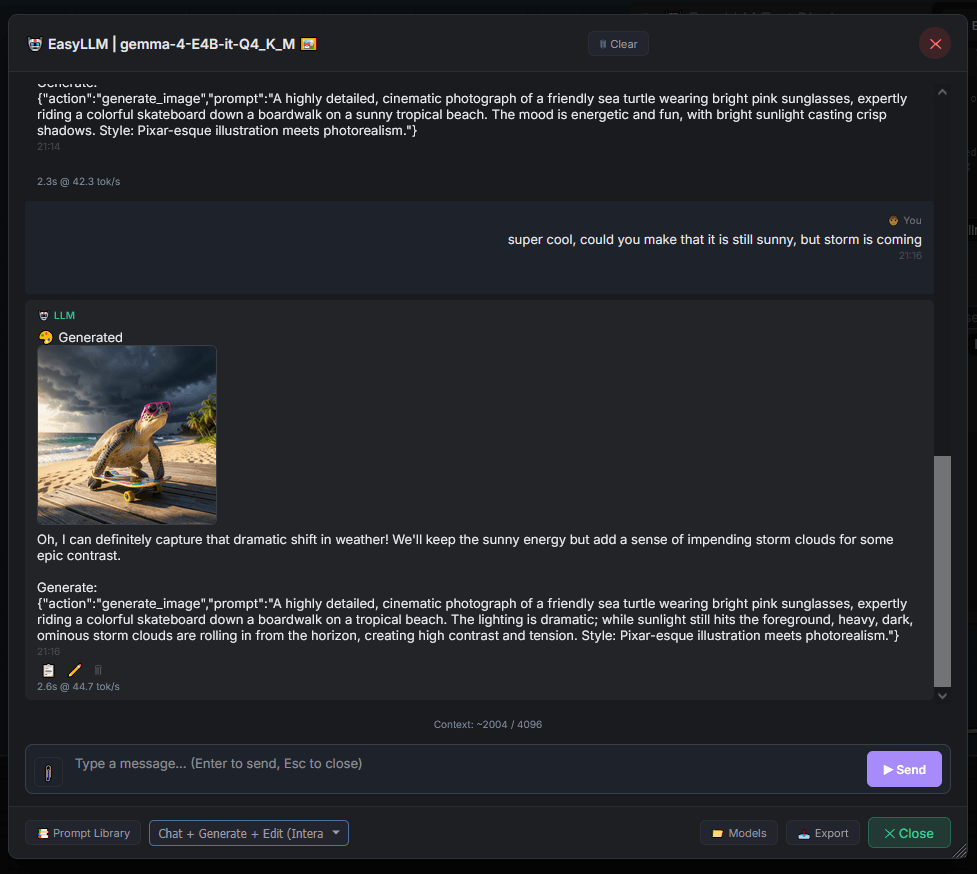
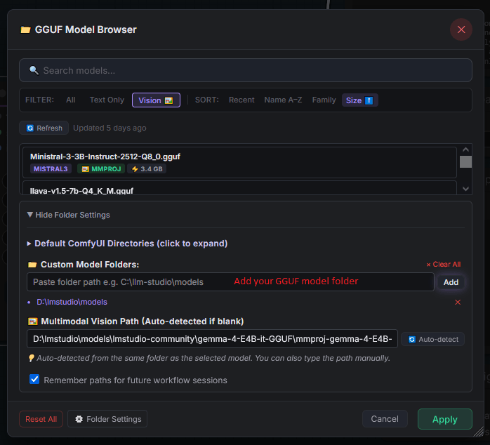
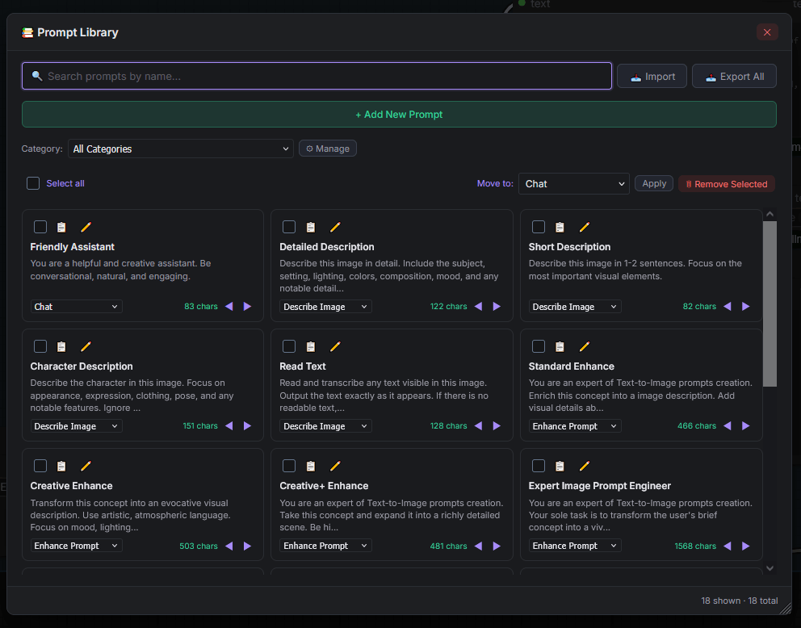
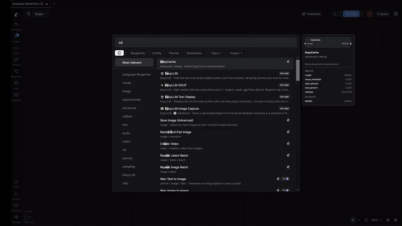

# EasyLLM for ComfyUI

Chat, prompt enhancement, and high-speed GGUF inference — all inside ComfyUI.
**No external services. No Ollama. No LM Studio. No API keys.**

> Already have models for LM Studio? Point EasyLLM at those folders and use the same GGUF files directly inside ComfyUI — no background servers required.
>
> **Note for Ollama users:** Ollama stores models in a proprietary format. Download the original `.gguf` file from Hugging Face instead.

---

## 📸 Screenshots

### Main Node & Chat Popup




### Model Browser & Prompt Library





### 🎥 Demo Video



---

## ✨ Key Features

| Feature | Description |
|---------|-------------|
| ⚡ **Local GGUF Inference** | 30–50+ tok/sec with llama.cpp C++ engine — same as Ollama/LM Studio |
| 🤖 **LLM Image Generation Agent** | Chat with the LLM — it decides when to generate or edit images, writes the prompts, and auto-queues your pipeline. Includes loadable workflows for Flux Klein 4B and other SD models |
| 🔍 **Built-in Model Browser** | Search, filter, and manage GGUF models with auto vision detection and architecture identification |
| 👁️ **Vision / Multimodal** | Upload images directly from chat — LLaVA, Qwen-VL, Gemma-3-Vision, with automatic mmproj detection |
| 💬 **Streaming Chat** | Real-time token streaming with markdown rendering and conversation history |
| 🔧 **Prompt Enhancement** | Transform simple concepts into detailed image prompts — wire directly to CLIP Text Encode → KSampler |
| 📚 **System Prompt Manager** | 11 built-in templates + custom creation, editing, import/export, and sharing — a complete prompt engineering toolkit |
| 📝 **Text Utility Nodes** | 7 lightweight text processing nodes — no dependencies |
| 🧹 **Smart History Database** | Persistent chat & enhancer history with atomic writes, auto-cleanup by age and size limits |
| 🔗 **Socket-Chainable Inputs** | Feed `text` and `system_prompt` from other nodes — build dynamic multi-node prompt pipelines |

📖 [See all features →](docs/features.md)

---

## 🚀 Quick Start

### ⚡ GGUF Backend (Recommended — 30–50+ tok/sec)

**One-click install** — double-click the launcher for your platform:

| Platform | File |
|----------|------|
| 🪟 **Windows** | `launchers/run_launcher.bat` |
| 🐧 **Linux** | `launchers/run_launcher.sh` |
| 🍎 **macOS** | `launchers/run_launcher.command` |

Or run manually:
```bash
python custom_nodes\ComfyUI-EasyLLM\install.py
```

Minimal workflow:
```
[EasyLLM GGUF] ──> [EasyLLM Text]
     │ model_path: "path/to/model.gguf"
     │ text: "explain how diffusion models work"
```

> 💡 **No models yet?** Open the **Model Browser** from the node — it searches your ComfyUI model folders and any custom directories you add.

### 🤖 CLIP Backend (Zero install — works immediately)

```
[Load CLIP (Anima)] ──> [EasyLLM] ──> [CLIP Text Encode] ──> [KSampler]
```

Uses the Qwen model already loaded inside your CLIP text encoder. No pip installs needed.

### 🤖 LLM as Image Agent (Multi-Turn Generation)

```
EasyLLM ──trigger_prompt──► Trigger Router ──prompt──► CLIP Text Encode ──► KSampler
                                            └──session──► Image Capture ◄── VAE Decode
```

The LLM outputs structured JSON with `action` fields (`generate_image`, `edit_image`, `just_chat`). The frontend auto-queues the pipeline when image generation is requested. Loadable workflows included for Flux Klein 4B and other models.

📖 [Workflow examples →](docs/workflows.md)

---

## 📦 Installation

1. Clone into `ComfyUI/custom_nodes/`
2. Restart ComfyUI
3. For GGUF acceleration: double-click a launcher or run `python install.py`

> 📦 **ComfyUI Manager users:** `install.py` is auto-discovered — GGUF backend installs automatically when adding via Manager.

📖 [Full installation guide (all GPUs, manual install, troubleshooting) →](docs/installation.md)

---

## 📖 Documentation

| Topic | Description |
|-------|-------------|
| [Features](docs/features.md) | Complete feature list with all 3 tiers |
| [Installation](docs/installation.md) | All GPU variants, launchers, manual install |
| [Node Reference](docs/nodes/) | Full parameter tables for every node |
| [Workflow Examples](docs/workflows.md) | Prompt enhancement, chat, multi-turn generation |
| [Chat UI](docs/chat-ui.md) | Popup chat, canvas widgets, modes, export |
| [System Prompts](docs/system-prompts.md) | Built-in templates, custom creation, import/export |
| [Text Utilities](docs/text-utilities.md) | 7 text processing nodes |
| [Compatible Models](docs/models.md) | GGUF and CLIP model recommendations |
| [Speed Optimization](docs/speed-optimization.md) | Unlock 30–50+ tok/sec |
| [Auto-Tuned Sampling](docs/auto-tuning.md) | How automatic parameter tuning works |
| [Chat Templates](docs/chat-templates.md) | 3-tier auto-detection pipeline |
| [Vision / Multimodal](docs/vision.md) | Image upload, mmproj, vision-language models |
| [Technical Details](docs/technical.md) | Internals, architecture, GPU acceleration |
| [Troubleshooting](docs/troubleshooting.md) | Common issues and solutions |
| [Configuration](docs/configuration.md) | config_user.py override system |
