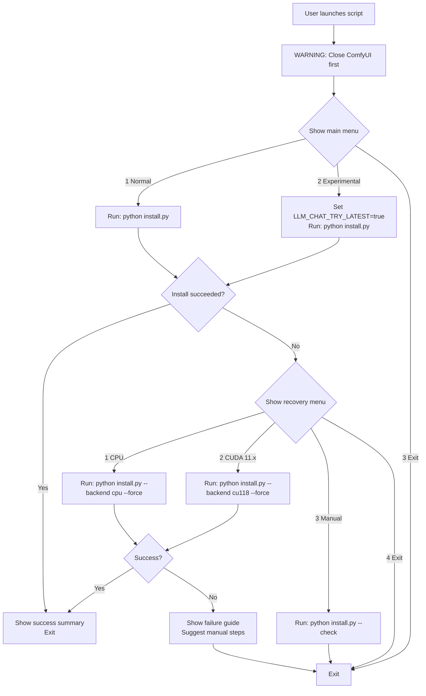

# LLM Chat Launcher Files

These launcher scripts provide a simple interactive menu to run the
[`install.py`](../install.py) script with different execution profiles —
no terminal commands needed.

## Main Menu Options

| Option | Description |
|--------|-------------|
| **1 — Normal Mode** | Smart auto-selection. On older CPUs, the safe baseline version is installed for guaranteed compatibility. On modern CPUs, the latest version is used. |
| **2 — Experimental Mode** | Forces the latest llama-cpp-python wheel even on older CPUs. Sets the `LLM_CHAT_TRY_LATEST=true` environment variable before running `install.py`. |
| **3 — Exit** | Closes the launcher. |

## Recovery Menu (shown on failure)

If the installation fails, a **recovery menu** appears automatically with
backup options — no need to re-run the launcher:

| Option | Description |
|--------|-------------|
| **1 — Retry with CPU-only backend** | Falls back to a CPU-only wheel. Slower but guaranteed to work on any system. Runs `python install.py --backend cpu --force`. |
| **2 — Retry with CUDA 11.x backend** | Falls back to CUDA 11.x (cu118), which is better suited for older GPUs like GTX 1660, GTX 1080, RTX 2080, etc. Runs `python install.py --backend cu118 --force`. |
| **3 — Show manual guide** | Prints manual installation instructions you can copy and run yourself. |
| **4 — Exit** | Closes the launcher. |

## Flow Diagram

```
You (double-click launcher)
    │
    ▼
┌──────────────────────────────────┐
│  WARNING: Close ComfyUI first!   │
└──────────────┬───────────────────┘
               │
               ▼
┌──────────────────────────────────┐
│  Main Menu                       │
│  [1] Normal                      │
│  [2] Experimental                │
│  [3] Exit                        │
└──────────┬───────────────────────┘
           │ choice
           ▼
┌──────────────────────────────────┐
│  Runs: python install.py         │
│  (with or without                │
│   LLM_CHAT_TRY_LATEST)           │
└──────────┬───────────────────────┘
           │
           ▼
    ┌──────┴──────┐
    ▼              ▼
┌────────┐  ┌──────────────────────┐
│ SUCCESS│  │ FAILURE              │
│ (exit) │  │ Recovery Menu:       │
│        │  │ [1] Retry CPU-only   │
│        │  │ [2] Retry CUDA 11.x  │
│        │  │ [3] Manual guide     │
│        │  │ [4] Exit             │
└────────┘  └──────────────────────┘
```

---

## ⚠ Important: Close ComfyUI First

Before running any installation, **make sure ComfyUI is closed**.
If ComfyUI is running, its Python process may lock the package files,
causing `pip install` to fail with "Permission denied" errors.

All launcher scripts show this warning at startup, and [`install.py`](../install.py)
also prints it before proceeding.

---

## Platform Instructions

### 🪟 Windows — [`run_launcher.bat`](run_launcher.bat)

1. **Double-click** `run_launcher.bat` in File Explorer
2. A terminal window opens showing the interactive menu
3. Press **1**, **2**, or **3** on your keyboard (no Enter needed)
4. The launcher runs `install.py` with your chosen profile
5. If installation fails, the recovery menu appears automatically

> **Note:** Windows may show a SmartScreen warning. Click "More info" → "Run anyway" — the script is safe.

### 🐧 Linux — [`run_launcher.sh`](run_launcher.sh)

1. Open a terminal in this directory
2. Make the script executable (one-time):
   ```bash
   chmod +x run_launcher.sh
   ```
3. Run the launcher:
   ```bash
   ./run_launcher.sh
   ```
4. Type **1**, **2**, or **3** and press Enter
5. If installation fails, the recovery menu appears automatically

> **Tip:** You can create a desktop shortcut pointing to `run_launcher.sh` for one-click access.

### 🍎 macOS — [`run_launcher.command`](run_launcher.command)

1. Open **Terminal.app** and navigate to this directory
2. Make the script executable (one-time):
   ```bash
   chmod +x run_launcher.command
   ```
3. After `chmod +x`, you can **double-click** `run_launcher.command` in Finder
   — macOS automatically opens Terminal.app and runs the script
4. Type **1**, **2**, or **3** and press Enter
5. If installation fails, the recovery menu appears automatically

> **Important:** The `.command` file **must** be made executable with `chmod +x`
> before double-clicking works. This is a one-time setup step.

---

## How It Works



The launcher resolves its own directory to find `install.py` in the parent
folder, so it works regardless of where the launcher is double-clicked from.

---

## Troubleshooting

| Issue | Solution |
|-------|----------|
| **"python is not recognized"** (Windows) | Python is not in your PATH. Run `python_embeded\python.exe install.py` directly instead. |
| **"python3: command not found"** (Linux/Mac) | Try `python` instead of `python3`, or install Python 3. |
| **Double-click on Mac just opens a text editor** | Run `chmod +x run_launcher.command` in Terminal first. |
| **Permission denied** (Linux/Mac) | Run `chmod +x run_launcher.sh` (or `.command`) first. |
| **Install keeps failing even with recovery options** | Your system may need a C++ compiler. See the [README](../README.md) for source compilation instructions. |
| **"Access is denied" / "Permission denied" during install** | You didn't close ComfyUI! Close it completely and try again. |
